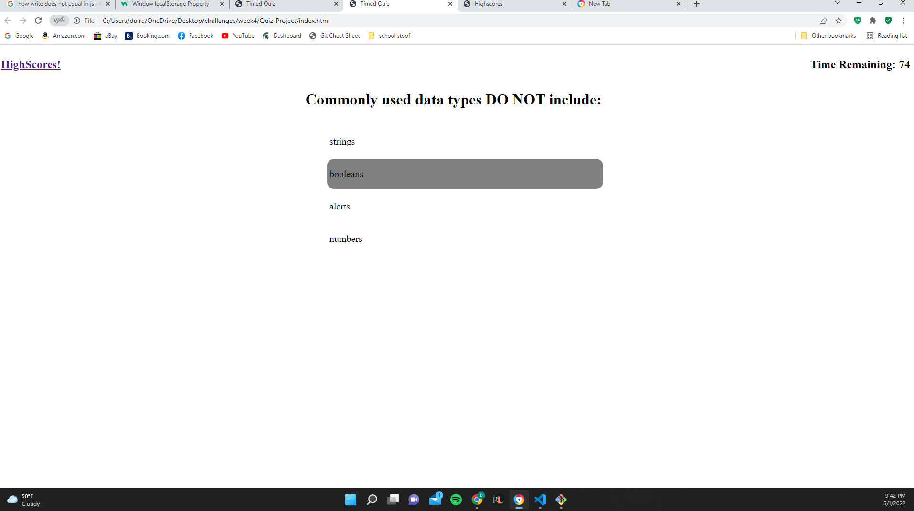
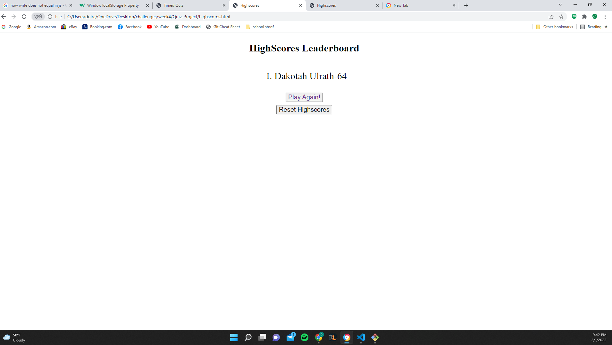

# Quiz-Project

## Description
The purpose of the project was to utilize web API functions to create a quiz that was times, and that the highscores could be saved afterwards. I managed to get the quiz created, and the timer to countdown, but upon answering wrong, and minusing the 10 seconds for the wrong answer, it would immediately go back to the original place in the timer. i added a green highlight for correct answers and a red highlight for wrong answers. i added a highlight hover function to hover over the choices for the answers. i then created a highscores page and a highscores js file. this allowed me to access the score that was saved at the end of the quiz to local storage, and add a name to it, and then post it to the highscores page. i added a href to the main page that will take you to the highscores page, and i added a button to the highscores page to play again. i also added a button to the highscores page to clear the current local storage, thus deleting all of the highscores.

### Notes
this was a somewhat challenging task for me, i ended up googling a lot of stuff and basically just doing trial and error until it worked. i did my best in terms of the javascript, although i know the css is a little sloppy.

### Links
